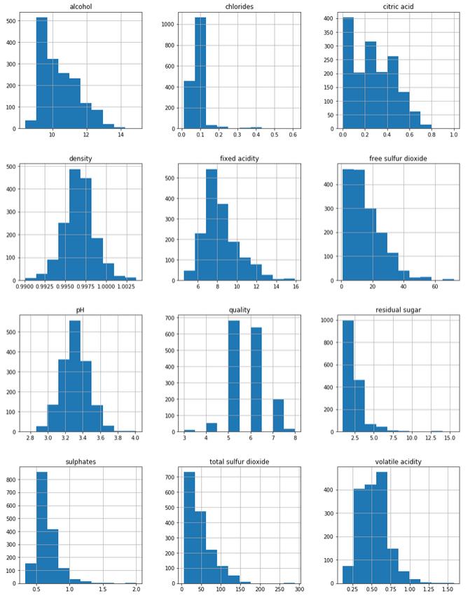

# Wine-classification
Model wine quality based on physicochemical tests

## First look on data
### Dataframe

### Histograms

### Pairplot

### Linear regression
 coefficient:  
Training set  
0.35485287452056635  
Test set  
0.37228312008181064  
Coefficients:  
2.18600313e-02, -1.00869523e+00, -1.33904164e-01,  8.85944150e-03,  
-1.75557840e+00,  5.00853894e-03, -3.65426072e-03, -1.62236478e+01,  
-3.43939544e-01,  8.19819425e-01,  2.86228187e-01  
Intercept:  
20.028917356887142  
### Bayesian regression
 coefficient:  
Training set  
0.35310060612590055  
Test set  
0.3665011195723745  
Coefficients:  
1.38579182e-02, -1.02598246e+00, -1.53516232e-01,  2.35390036e-04,  
-1.03607519e+00,  5.15799897e-03, -3.57325308e-03, -1.10857236e-02,  
-3.37203700e-01,  6.96471002e-01,  3.08705097e-01  
Intercept:  
3.726953267082616  
###Logistic regression
 coefficient:  
Training set:  
0.6138448707256047  
Test set:  
0.5875  
#### Accuracy
Training set:  
0.6138448707256047  
Test set:  
0.5875  
#### Confusion matrix

